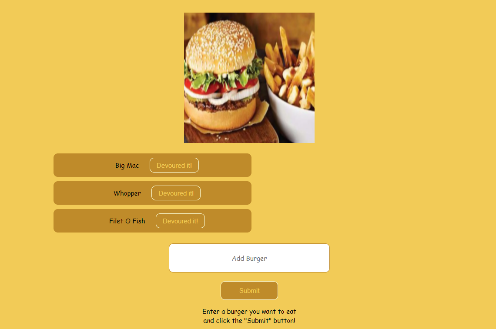

# Project Title: Eat Da Burger

### Installation:
-Download or clone repository
-Node.js is required to run the application
-Npm install to install the required npm packages   

 ### Usage:
 -Application will be invoked by using the following command:
 -node server.js
 -Run local host 8080 in your browser

 ### Contributing:
 Contributions made by Jordan Mossing using various technolgies. 

 ### Screenshot:

 ### 

### Link: https://burger12-jordan.herokuapp.com/
### Link: https://jmo1point0.github.io/Burger12/

 ### Questions:
 
Reach out to me on my GitHub page at the following Link:
 -[GitHub Profile](https://github.com/jmo1point0)    
 Or by email: jordan.mossing@gmail.com